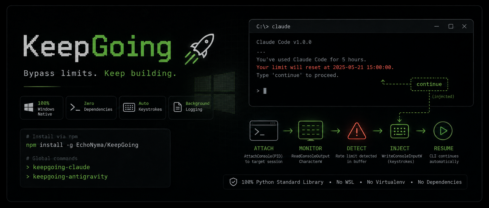

# KeepGoing 🚀

**KeepGoing** is a collection of 100% Windows-native background monitoring scripts designed to automatically resume CLI AI agents after their API/rate limits reset (like **Claude Code**, **Antigravity**, and **OpenAI Codex CLI**) without requiring WSL, virtual environments, or heavy dependencies. 

It hooks into running terminal console buffers, detects rate limits, and simulates keystrokes to resume execution as soon as limits expire.

---

## ⚠️ Disclaimer & Safety

**Terms of Service.** KeepGoing resumes a session by simulating keystrokes into an *interactive subscription session* — it does **not** access anything through an API key. Anthropic's (and other providers') Terms restrict automated / non-human access to their services except via an API key or where explicitly permitted. A reasonable reading is that automating a subscription CLI this way falls under that restriction. **Use at your own risk.** If you need ToS-safe automation, drive the agent through its official API key / headless mode instead.

**Auto-resume can amplify a misbehaving agent.** Blindly sending `continue` after the agent has lost context can make things *worse* — it may forget the original constraints and spawn runaway work, burning your whole quota in minutes. Do **not** leave it unattended on open-ended or destructive tasks. Treat it as a convenience for resuming well-scoped work, not a hands-off autopilot.

---

## Features

- **100% Windows Native:** Tailored for PowerShell and Windows Command Prompt. Uses built-in Python `ctypes` to bind directly to Windows Kernel32 APIs (`AttachConsole`, `ReadConsoleOutputCharacterW`, and `WriteConsoleInputW`).
- **Zero Dependencies:** Pure Python standard library. No `pip install`, no `wexpect`, no `pywin32`.
- **Automatic Session Hook & Installer:** Registers itself automatically inside **Claude Code**'s `settings.json` hook system. Starts silently in the background and attaches to the correct window.
- **Liveness Monitoring:** Monitors the target console shell PID using `GetExitCodeProcess` to ensure background workers exit instantly when the shell closes (no zombie python background processes).
- **CLI Configuration:** Control wait margins, fallback timings, and log file paths using argparse CLI options.
- **Background Logging:** All logs are written to customizable log files (`~/claude_attach_log.txt`, `~/antigravity_attach_log.txt`, and `~/codex_attach_log.txt` by default) to avoid cluttering your interactive terminal session.

---

## Repository Contents

- [`claude_attach.py`](claude_attach.py) - Tailored for the official **Claude Code CLI**. Watches for the 5-hour subscription limit and sends `"continue"`.
- [`antigravity_attach.py`](antigravity_attach.py) - Tailored for **Antigravity CLI**. Watches for Gemini API rate limits (`ResourceExhausted` / `429`) and sends an `Enter` input key.
- [`codex_attach.py`](codex_attach.py) - Tailored for **OpenAI Codex CLI**. Watches for the usage-limit message (`"You've hit your usage limit"`) and sends an `Enter` input key to resume.
- `LICENSE` - Official MIT License.

---

## 📦 Quick Installation via npm

You can install this repository directly as a global command-line package using `npm`:

```bash
npm install -g EchoNyma/KeepGoing
```

This registers the following global commands on your system:
- **`keepgoing-claude`**: Invokes the Claude Code monitoring script.
- **`keepgoing-antigravity`**: Invokes the Antigravity monitoring script.
- **`keepgoing-codex`**: Invokes the OpenAI Codex CLI monitoring script.

*(Note: Requires `python` to be installed and available in your system path).*

---

## 🛠️ Claude Code Integration (Automatic)

To configure Claude Code to automatically launch the background monitor every time you start a session:

1. Run the auto-installer command:
   ```bash
   keepgoing-claude --install
   ```
2. The script will automatically parse your `~/.claude/settings.json`, create a `SessionStart` hook, and register the background watcher.
3. Done! Now, whenever you type `claude` in your terminal, the script will silently launch, hook into your session, and sleep in the background until a limit is reached.

---

## 🛠️ Manual Use (Antigravity & OpenAI Codex CLI)

The Antigravity and Codex watchers are **manual-only** — unlike `keepgoing-claude`, they have no `--install`/`--hook` mode, so you start them yourself in a separate window:

1. Start your active agent session in your primary terminal window.
2. Open a **second terminal window** (PowerShell or CMD) and run the matching command:
   ```powershell
   keepgoing-antigravity   # for the Antigravity CLI
   keepgoing-codex         # for the OpenAI Codex CLI
   ```
   *(Or specify a target PID directly, e.g. `keepgoing-codex 1234`.)*
3. The script will list all active processes. Type the number corresponding to your active session and press **Enter**.
4. The monitor window will initialize, display a success message, and detach (becoming muted).
5. Open your logfile to watch it work live:
   ```powershell
   Get-Content -Wait ~\antigravity_attach_log.txt   # or ~\codex_attach_log.txt
   ```

---

## ⚙️ CLI Reference

### `keepgoing-claude`
```text
usage: keepgoing-claude [-h] [--hook] [--install] [--margin MARGIN]
                        [--fallback FALLBACK] [--log-path LOG_PATH]
                        [pid]

positional arguments:
  pid                  Process ID of the Claude console session to attach to.

options:
  -h, --help           show this help message and exit
  --hook               Launch in automatic Hook mode (detects grandparent PID automatically).
  --install            Register the SessionStart hook in global Claude Code config.
  --margin MARGIN      Margin in seconds to wait after rate-limit reset (default 60).
  --fallback FALLBACK  Fallback hours to wait if reset time cannot be parsed (default 5).
  --log-path LOG_PATH  Custom path for the logfile.
```

### `keepgoing-antigravity`
```text
usage: keepgoing-antigravity [-h] [--margin MARGIN] [--fallback FALLBACK]
                             [--log-path LOG_PATH]
                             [pid]

positional arguments:
  pid                  Process ID of the Antigravity console session to attach to.

options:
  -h, --help           show this help message and exit
  --margin MARGIN      Margin in seconds to wait after rate-limit reset (default 5).
  --fallback FALLBACK  Fallback seconds to wait if reset time cannot be parsed (default 60).
  --log-path LOG_PATH  Custom path for the logfile.
```

### `keepgoing-codex`
```text
usage: keepgoing-codex [-h] [--margin MARGIN] [--fallback FALLBACK]
                       [--log-path LOG_PATH]
                       [pid]

positional arguments:
  pid                  Process ID of the Codex console session to attach to.

options:
  -h, --help           show this help message and exit
  --margin MARGIN      Margin in seconds to wait after rate-limit reset (default 60).
  --fallback FALLBACK  Fallback seconds to wait if reset time cannot be parsed (default 3600 = 1 hour).
  --log-path LOG_PATH  Custom path for the logfile.
```

*(Like `keepgoing-antigravity`, the Codex watcher is manual-only — no `--hook`/`--install`.)*

---

## How it Works under the Hood 🧠

1. **`AttachConsole(PID)`**: On Windows, terminal processes share a console buffer. The script detaches from its own console window (`FreeConsole`) and attaches directly to the console buffer of the running target process.
2. **`ReadConsoleOutputCharacterW`**: It periodically scrapes the last 50 lines of the target's screen text directly from the Windows console buffer.
3. **`WriteConsoleInputW`**: When a rate limit warning is detected, the script converts the target continuation string (e.g., `continue\n`) into low-level keyboard event records (`KEY_EVENT_RECORD` structures representing key-down and key-up strokes) and writes them directly into the console input buffer. The target CLI reads this queue and interprets the characters as physical user keystrokes.
