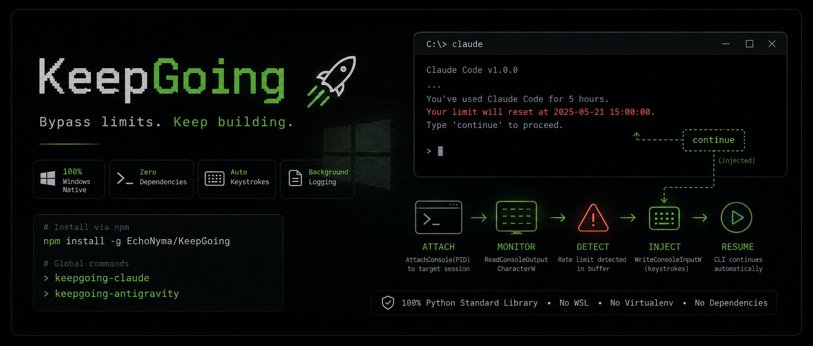

# KeepGoing 🚀

**KeepGoing** is a collection of 100% Windows-native background monitoring scripts designed to automatically resume AI agents and tools after their API/rate limits reset (like **Claude Code**, **Antigravity**, **OpenAI Codex CLI**, and the **ChatGPT Windows Desktop App**) without requiring WSL, virtual environments, or heavy dependencies.

It hooks into running terminal console buffers for the legacy CLI monitors and uses a task-aware protocol path for the ChatGPT Desktop App. The ChatGPT primary path does not focus windows or simulate input.

---

## ⚠️ Disclaimer & Safety

**Terms of Service.** The legacy CLI and `--legacy-uia` compatibility paths resume a session by simulating keystrokes into an *interactive subscription session* — they do **not** access anything through an API key. The primary ChatGPT Desktop path uses the app's task protocols and does not simulate input. Anthropic's (and other providers') Terms restrict automated / non-human access to their services except via an API key or where explicitly permitted. **Use at your own risk.** If you need ToS-safe automation, drive the agent through its official API key / headless mode instead.

**Auto-resume can amplify a misbehaving agent.** Blindly sending `continue` after the agent has lost context can make things *worse* — it may forget the original constraints and spawn runaway work, burning your whole quota in minutes. Do **not** leave it unattended on open-ended or destructive tasks. Treat it as a convenience for resuming well-scoped work, not a hands-off autopilot.

---

## Features

- **100% Windows Native:** Tailored for PowerShell and Windows Command Prompt. Uses built-in Python `ctypes` to bind directly to Windows Kernel32, User32, and OLE32/UIAutomation APIs (`AttachConsole`, `ReadConsoleOutputCharacterW`, `WriteConsoleInputW`, and `IUIAutomation`).
- **Zero Dependencies:** Pure Python standard library. No `pip install`, no `wexpect`, no `pywin32`.
- **Automatic Session Hook & Installer:** Registers itself automatically inside **Claude Code**'s `settings.json` hook system. Starts silently in the background and attaches to the correct window.
- **ChatGPT Desktop App Support:** Manually starts a task-aware monitor that reads rate limits and task history through the bundled Codex App Server, then sends one exact-task continuation through the desktop app's Codex App Tools bridge.
- **Liveness Monitoring:** Monitors the target console shell PID or GUI process using `GetExitCodeProcess` to ensure background workers exit instantly when the target closes (no zombie python background processes).
- **CLI Configuration:** Control wait margins, fallback timings, continuation text, and log file paths using argparse CLI options.
- **Background Logging:** All logs are written to customizable log files (`~/claude_attach_log.txt`, `~/antigravity_attach_log.txt`, `~/codex_attach_log.txt`, and `%LOCALAPPDATA%/KeepGoing/logs/chatgpt-auto-resume.jsonl` by default) to avoid cluttering your interactive terminal session.

---

## Current Architecture

KeepGoing has two execution paths:

- **CLI monitors:** `claude_attach.py`, `antigravity_attach.py`, and `codex_attach.py` read Windows console buffers and inject a bounded continuation through the native console input queue. Claude Code can install its monitor through a `SessionStart` hook; the other CLI paths are manual.
- **ChatGPT Desktop monitor:** `keepgoing_chatgpt/` contains trusted runtime discovery, read-only App Server access, the desktop bridge, an atomic retry-state store, and the supervisor that coordinates detection, reset timing, exact-task dispatch, and post-send verification. `--legacy-uia` is an explicit compatibility path only.

The primary ChatGPT path is short-tick and stateful: it does not sleep for the full reset window, does not use UI Automation, and never dispatches a continuation without exact task/turn identity and verification.

---

## Repository Contents

- [`claude_attach.py`](claude_attach.py) - Tailored for the official **Claude Code CLI**. Watches for the 5-hour subscription limit and sends `"continue"`.
- [`antigravity_attach.py`](antigravity_attach.py) - Tailored for **Antigravity CLI**. Watches for Gemini API rate limits (`ResourceExhausted` / `429`) and sends an `Enter` input key.
- [`codex_attach.py`](codex_attach.py) - Tailored for **OpenAI Codex CLI**. Watches for the usage-limit message (`"You've hit your usage limit"`) and sends an `Enter` input key to resume.
- [`chatgpt_attach.py`](chatgpt_attach.py) - Tailored for the **ChatGPT Windows Desktop App**. Manually monitors local Codex tasks and resumes the exact failed task through the desktop app bridge. UI Automation is available only through the explicit `--legacy-uia` compatibility flag.
- `LICENSE` - Official MIT License.

---

## 📦 Quick Installation via npm

You can install this repository directly as a global command-line package using `npm`:

```bash
npm install -g EchoNyma/KeepGoing
```

This registers the following global commands on your system:
- **`keepgoing-claude`**: Invokes the Claude Code monitoring script.
- **`keepgoing-antigravity`**: Invokes the Antigravity monitoring script.
- **`keepgoing-codex`**: Invokes the OpenAI Codex CLI monitoring script.
- **`keepgoing-chatgpt`**: Invokes the ChatGPT Desktop App monitoring script.

*(Note: Requires `python` to be installed and available in your system path).*

---

## 🛠️ Claude Code Integration (Automatic)

To configure Claude Code to automatically launch the background monitor every time you start a session:

1. Run the auto-installer command:
   ```bash
   keepgoing-claude --install
   ```
2. The script will automatically parse your `~/.claude/settings.json`, create a `SessionStart` hook, and register the background watcher.
3. Done! Now, whenever you type `claude` in your terminal, the script will silently launch, hook into your session, and sleep in the background until a limit is reached.

---

## 🛠️ Manual Use (Antigravity, Codex CLI & ChatGPT App)

The Antigravity, Codex, and ChatGPT watchers are started directly from a terminal window:

1. Start your active agent session or ensure your ChatGPT Desktop app is running. For ChatGPT, note the Codex task ID that supplies the bridge executor context.
2. Open a **terminal window** (PowerShell or CMD) and run the matching command:
   ```powershell
   keepgoing-antigravity   # for the Antigravity CLI
   keepgoing-codex         # for the OpenAI Codex CLI
   keepgoing-chatgpt --executor-thread-id <executor-task-id>  # ChatGPT Desktop App
   ```
   *(You can also set `KEEPGOING_EXECUTOR_THREAD_ID` instead of the option. `--status` only reports the persisted queue.)*
3. The script manually connects to the running packaged app, discovers local task failures, waits for the authoritative five-hour reset, and verifies exact-task progress.
4. Open your logfile to watch it work live:
   ```powershell
   Get-Content -Wait "$env:LOCALAPPDATA\KeepGoing\logs\chatgpt-auto-resume.jsonl"
   ```

KeepGoing does not install an autostart entry, service, scheduled task, or ChatGPT hook for this monitor. Start it manually when needed. The primary ChatGPT path does not use UI Automation, focus changes, mouse/keyboard injection, or the clipboard. Use `--legacy-uia` only when explicitly choosing the old compatibility monitor.

The ChatGPT monitor stores each retry by the exact pair of task ID and failed-turn ID. It keeps scanning while other tasks wait for reset, persists transitions atomically, and uses `--status` to inspect the queue without starting a monitor or printing task prompts. A confirmed bridge send is persisted before post-send verification; an uncertain send is verified before any bounded retry.

---

## ⚙️ CLI Reference

### `keepgoing-claude`
```text
usage: keepgoing-claude [-h] [--hook] [--install] [--margin MARGIN]
                        [--fallback FALLBACK] [--log-path LOG_PATH]
                        [pid]

positional arguments:
  pid                  Process ID of the Claude console session to attach to.

options:
  -h, --help           show this help message and exit
  --hook               Launch in automatic Hook mode (detects grandparent PID automatically).
  --install            Register the SessionStart hook in global Claude Code config.
  --margin MARGIN      Margin in seconds to wait after rate-limit reset (default 60).
  --fallback FALLBACK  Fallback hours to wait if reset time cannot be parsed (default 5).
  --log-path LOG_PATH  Custom path for the logfile.
```

### `keepgoing-antigravity`
```text
usage: keepgoing-antigravity [-h] [--margin MARGIN] [--fallback FALLBACK]
                             [--log-path LOG_PATH]
                             [pid]

positional arguments:
  pid                  Process ID of the Antigravity console session to attach to.

options:
  -h, --help           show this help message and exit
  --margin MARGIN      Margin in seconds to wait after rate-limit reset (default 5).
  --fallback FALLBACK  Fallback seconds to wait if reset time cannot be parsed (default 60).
  --log-path LOG_PATH  Custom path for the logfile.
```

### `keepgoing-codex`
```text
usage: keepgoing-codex [-h] [--margin MARGIN] [--fallback FALLBACK]
                       [--log-path LOG_PATH]
                       [pid]

positional arguments:
  pid                  Process ID of the Codex console session to attach to.

options:
  -h, --help           show this help message and exit
  --margin MARGIN      Margin in seconds to wait after rate-limit reset (default 60).
  --fallback FALLBACK  Fallback seconds to wait if reset time cannot be parsed (default 3600 = 1 hour).
  --log-path LOG_PATH  Custom path for the logfile.
```

### `keepgoing-chatgpt`
```text
usage: keepgoing-chatgpt [-h] [--text TEXT] [--margin MARGIN]
                         [--fallback FALLBACK] [--log-path LOG_PATH]
                         [--status] [--legacy-uia]
                         [--executor-thread-id EXECUTOR_THREAD_ID]
                         [pid]

positional arguments:
  pid                  Legacy ChatGPT process ID; requires --legacy-uia.

options:
  -h, --help           show this help message and exit
  --text TEXT          Exact continuation text (default: keep going).
  --margin MARGIN      Seconds after the authoritative reset (default: 60).
  --fallback FALLBACK  Accepted for legacy compatibility; unused by the primary path.
  --log-path LOG_PATH  Custom path for the logfile.
  --status             Report persisted queue state without starting a monitor.
  --legacy-uia         Explicitly use the compatibility UI Automation monitor.
  --executor-thread-id EXECUTOR_THREAD_ID
                       Codex task ID used as the desktop bridge executor context.
```

---

## How it Works under the Hood 🧠

### CLI Agents (Claude Code, Antigravity, OpenAI Codex)
1. **`AttachConsole(PID)`**: On Windows, terminal processes share a console buffer. The script detaches from its own console window (`FreeConsole`) and attaches directly to the console buffer of the running target process.
2. **`ReadConsoleOutputCharacterW`**: It periodically scrapes the last 50 lines of the target's screen text directly from the Windows console buffer.
3. **`WriteConsoleInputW`**: When a rate limit warning is detected, the script converts the target continuation string into low-level keyboard event records (`KEY_EVENT_RECORD` structures representing key-down and key-up strokes) and writes them directly into the console input buffer.

### ChatGPT Windows Desktop App
1. **Trusted runtime discovery:** Finds the live packaged `ChatGPT.exe`, its descendant bundled `codex.exe`, the matching Node runtime, App Tools server, and named pipe. It never falls back to a global Codex binary.
2. **Read-only task awareness:** The bundled App Server supplies the account's primary five-hour bucket and local task histories. Failures are keyed by exact task ID and failed turn ID, including hidden tasks.
3. **Durable short-tick queue:** An atomic local state file records observation watermarks, reset timestamps, dispatch state, and verification progress. The monitor remains manually started and never sleeps for the reset duration.
4. **Exact-task dispatch:** After the authoritative reset and preflight checks, the desktop app's `send_message_to_thread` bridge method receives only the stored target task context and continuation text. The executor task ID is supplied separately as bridge metadata. A transport-uncertain send is verified before any bounded retry, and a confirmed send is persisted across monitor restarts.
5. **Compatibility path:** `--legacy-uia` explicitly routes to the older UI Automation implementation. It is not initialized by the primary entrypoint.

## Development

The project uses only the Python standard library. Run the full test suite with:

```powershell
npm test
```

The tests cover protocol parsing, runtime discovery, durable state transitions, exact-task dispatch, retry verification, and the legacy UI Automation compatibility path.
